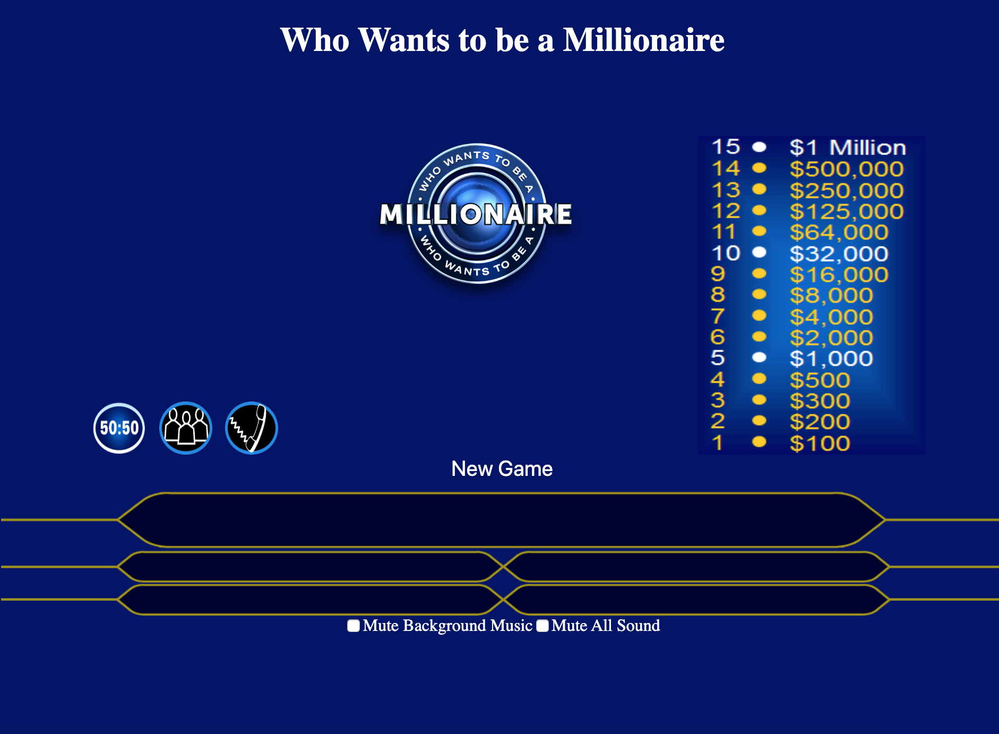

# Who Wants to be a Millionaire

Screenshot:

Link to game: https://xhaferllari11.github.io/millionaire-image/

All front end - HTML/CSS/JS

This is essentially like the game show.

Each time a new game is started (using the New Game button), the program calls an API from triviaDB and retrieves 40 answers.

Program organizes them in order of difficulty and and picks a question based on difficulty level (1-15).

The right answer is randomly placed in one of the answer choices.

## Lifelines:

**50 50**: removes two wrong answers at random.

**call a friend**: friend will randmoly guess an answer, but depending on question difficuly, it is biased to the right answer. If question difficulty is less than 10, friend most likely guessed the right answer. if higher, then it's roughly a 50% chance friend will guess right.

**ask the audiance**: right answer is guessed right based on question difficulty, other answers are populated randomnly. this graph is produced using quickcharts.io by calling a url that produces a graph from charts.js. 

